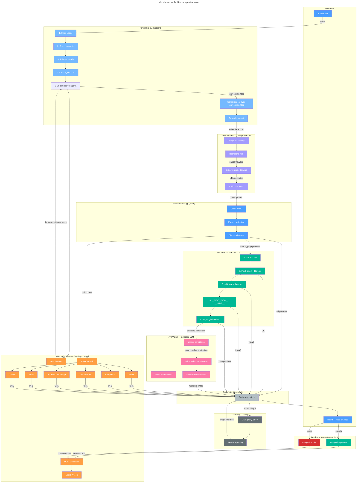

# Moodboard Generator

Outil de creation de moodboards visuels a partir de donnees JSON ou YAML. Concu pour les scenarios JDR, le voyage, la fiction, l'illustration, la deco ou la mode.

## Fonctionnalites

### Editeur

- **JSON et YAML** — coller du JSON ou YAML dans l'editeur, auto-detection du format
- **Import fichier** — importer un `.json`, `.yaml` ou `.yml` via le bouton ou par glisser-deposer
- **Exemple integre** — charger un moodboard de demonstration en un clic
- **Validation** — messages d'erreur clairs sur les champs manquants ou invalides

### Affichage

- **Layout masonry** — grille en colonnes CSS (2, 3 ou 4 colonnes)
- **4 tailles de cartes** — `full` (pleine largeur, hero), `tall` (pleine largeur, moyenne), `half` (une colonne), `third` (compact)
- **Annotations** — lieu, date et tags affiches en overlay sur chaque image
- **Positionnement intelligent** — detection automatique du point de focus de l'image (centre, haut, bas) selon les mots-cles et tags
- **Filtres image** — luminosite, contraste et saturation ajustables en temps reel

### Personnalisation

- Couleur de fond et couleur des tags
- Opacite des annotations
- Espacement et arrondi des cartes
- Nombre de colonnes (2 / 3 / 4)
- Filtres image avec reset

### Export et partage

- **PDF multi-pages** — export en A4 portrait, A4 paysage ou A3 portrait, avec pagination automatique
- **Impression** — `@page` injectee dynamiquement selon le format choisi
- **Permalink** — les donnees du moodboard sont compressees (lz-string) dans le hash de l'URL. Recharger la page ou partager le lien restaure le board
- **Bouton Partager** — copie le permalink dans le presse-papier

### Skill IA

Generateur de prompts pour demander a une IA (Claude, ChatGPT, Cursor...) de creer le fichier de donnees du moodboard :

- Choix de l'agent IA cible
- Categories d'usage (voyage, fiction, illustration, deco, mode, JDR)
- Sujet et contexte optionnels
- Themes visuels configurables
- Telechargement d'un fichier `.md` avec les instructions completes

## Format des donnees

```yaml
scenario: Titre du scenario
contexte: Systeme · Epoque · Lieu
images:
  - url: https://...
    lieu: Nom du lieu
    date: "2024"
    taille: full
    tags: [ambiance, tag-deux]
```

Equivalent JSON accepte. Seuls `scenario` et `images[].url` sont obligatoires.

**Tailles** : `full` (pleine largeur, haute) · `tall` (pleine largeur) · `half` (une colonne) · `third` (compact)

## Lancer le projet

```bash
pnpm install
pnpm dev
```

## Deploiement

```bash
pnpm deploy:prod
```

Build Vite + transfert SSH vers Alwaysdata (`/home/jdrspace/www/moodboard`).

## Stack

React 19 · TypeScript · Vite · js-yaml · lz-string · html2canvas · jsPDF


