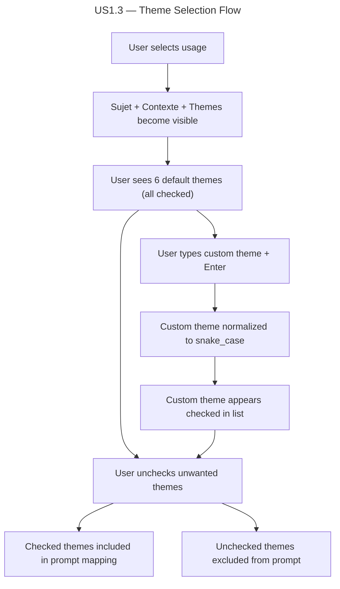

# Instruction: US1.3 — Sélection des thèmes visuels

## Feature

- **Summary**: Move visual themes section out of the sources gate so it appears immediately after usage selection
- **Stack**: `React 19.2, TypeScript 5.9, Vite 8`
- **Branch name**: `feat/us1.3-themes-visuels`
- **Parent Plan**: `none`
- **Sequence**: `standalone`
- Confidence: 10/10
- Time to implement: ~15 min

## Existing files

- @src/components/Editor/Editor.tsx
- @src/components/Editor/Editor.css
- @src/utils/skillContent.ts
- @src/types.ts

### New file to create

- none

## User Journey

## Implementation phases

### Phase 1 — Move themes out of sources gate

> Make themes visible immediately after usage selection, like sujet/contexte

1. In Editor.tsx, move the themes `
` block (lines 322-350) from inside the `sources !== null` gate to inside the `usage !== null` gate
2. Keep the agent selector and download button inside the `sources !== null` gate
3. Verify themes state and callbacks still work correctly in the new position

## Validation flow

1. Start the app, verify only usage pills are visible
2. Select a usage — sujet, contexte AND themes should all appear
3. Verify all 6 default themes are checked
4. Uncheck a theme — confirm it visually updates
5. Re-check — confirm it visually updates
6. Type "mon nouveau thème" + Enter — confirm it appears as `mon_nouveau_thème` (snake_case) and is checked
7. Add duplicate custom theme — confirm no duplicate appears
8. Download prompt — confirm only checked themes appear in the MAPPING section
9. Confirm agent selector and download button still appear only after sources load
