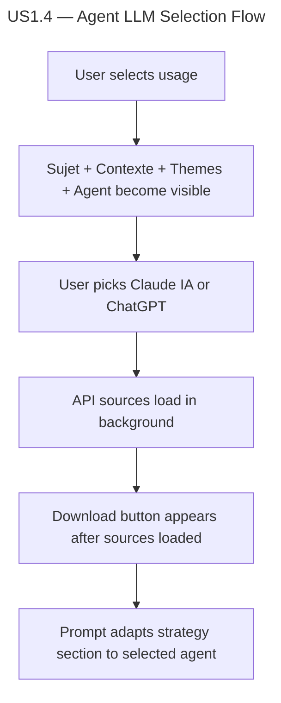

# Instruction: US1.4 — Choix agent LLM

## Feature

- **Summary**: Move agent LLM selector out of the sources gate so it appears immediately after usage selection, alongside sujet/contexte/themes
- **Stack**: `React 19.2, TypeScript 5.9, Vite 8`
- **Branch name**: `feat/us1.4-agent-llm`
- **Parent Plan**: `none`
- **Sequence**: `standalone`
- Confidence: 10/10
- Time to implement: ~10 min

## Existing files

- @src/components/Editor/Editor.tsx
- @src/utils/skillContent.ts

### New file to create

- none

## User Journey

## Implementation phases

### Phase 1 — Move agent selector out of sources gate

> Make agent selector visible immediately after usage selection, after themes

1. In Editor.tsx, move the agent `
` block from inside the `sources !== null` gate to inside the `usage !== null` gate, after the themes block
2. Only the download button and its wrapper remain inside the `sources !== null` gate
3. Verify agent state and prompt generation still work correctly

## Validation flow

1. Start the app, verify only usage pills are visible
2. Select a usage — sujet, contexte, themes AND agent selector should all appear
3. Verify Claude IA is selected by default
4. Switch to ChatGPT — confirm radio button updates
5. Switch back to Claude IA — confirm radio button updates
6. Wait for sources to load — confirm download button appears
7. Download prompt — confirm strategy section matches selected agent
